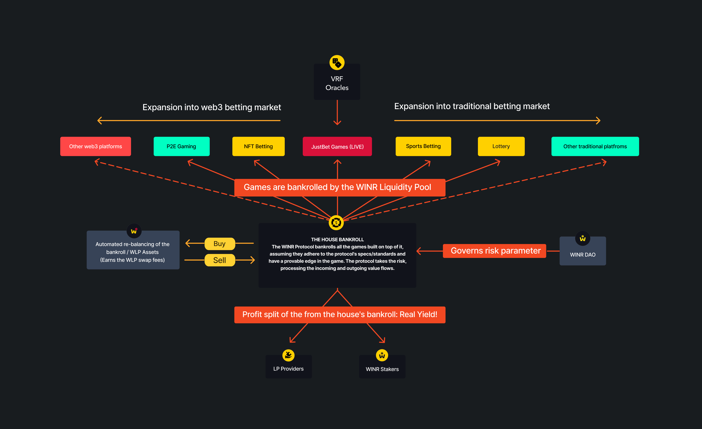
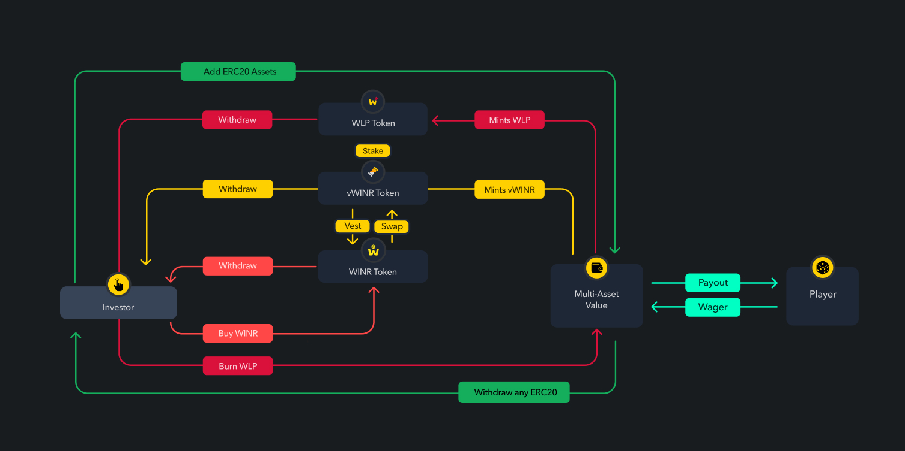
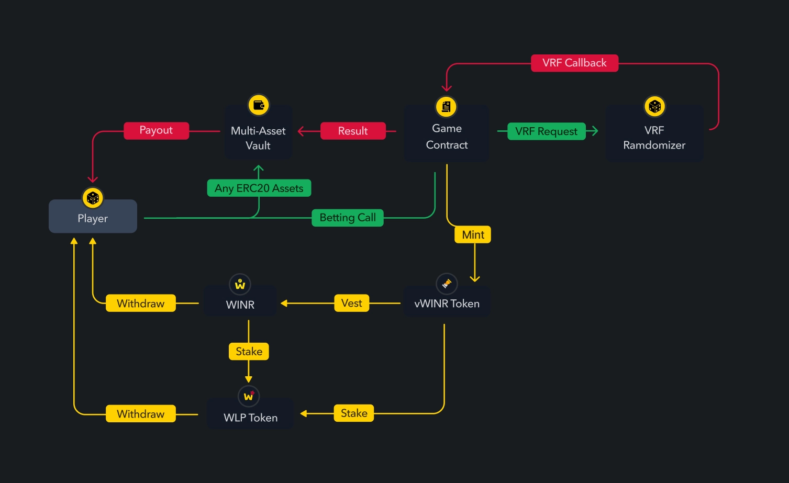

# WINR Protocol

> Decentralized On-Chain E-Gaming Infrastructure.

<center>The WINR Protocol pioneers the transition of e-gaming to web3 by providing smart contract tools, a liquidity engine, and an incentive framework to builders.</center>

---

## Overview WINR Protocol
The WINR Protocol smart contract-based game engine introduces a concept and infrastructure to make it easier for on-chain game developers and producers to create engaging, immersive experiences.



The WINR Protocol Game Engine is an innovative framework that streamlines the process of creating on-chain games, allowing developers to focus on game mechanics and design rather than getting bogged down in complex smart contract development.

One of the critical components of the WINR Protocol Game Engine is its ease of use. The engine eases to process to pull and push on-chain data, both for on-chain actions and off-chain. The game engine is backward compatible, so our framework minimizes the need for rewrites and incentivizes further development in case of an upgrade to the game. 

---

## Architecture

### Technical overview - Token dynamics



### Technical overview - User flow dynamics


### Design choices
At WINR Protocol, we believe that smart contract design is a critical aspect of building trust and reliability into our bankroll liquidity engine.

#### Maximizing Trustlessness
To ensure that our smart contracts are maximally trustless, we have chosen not to use any upgradable proxies. This means that the code for our smart contracts is immutable and cannot be changed, except through a new deployment. This design choice enhances security by reducing the attack surface and minimizing the risk of bugs or vulnerabilities being introduced through upgrades.

#### Using Reputable Blueprints
We have used the GMX repository, a reputable and well-tested repository, as the blueprint for our WLP vault. This ensures that we have a strong foundation for our smart contracts and reduces the likelihood of unexpected issues arising.

#### Protecting Important Functions
To safeguard against unauthorized or accidental changes to our smart contracts, we have implemented time locks on all important functions. This ensures that any proposed changes will be subject to a waiting period, during which they can be reviewed and challenged if necessary.

#### Implementing Circuit Breakers
We have also implemented circuit breakers in our smart contracts to protect against huge unexpected shortfalls. In the event of a large loss or other unexpected event, the circuit breakers can be triggered to pause the smart contract and prevent further losses or damage.

## Installation and configuration 

### Setup
```
git clone git@github.com:winrprotocol/WINR_Protocol.git
cd WINR_PROTOCOL
yarn install
forge install
```

### Compiling
```
yarn hardhat compile
forge build
```

---

# Contracts 

### AccessControlBase.sol
AccessControlBase is a contract for access control management. It provides basic access control functionality such as role-based access control and permission management.

### FeeCollector.sol
FeeCollector is a contract for collecting fees. It allows for the collection of fees from various sources, such as trading fees or liquidity provider fees.

### OracleRouterSimple.sol
OracleRouterSimple is a simple contract for routing price data from different oracles. It allows for the selection of a primary oracle, as well as fallback oracles in case the primary oracle fails.

### Reader.sol
Reader is a contract for reading data from other contracts. It allows for the reading of contract state and other data from external contracts.

### Router.sol
Router is a contract for routing trades between different liquidity sources. It allows for the routing of trades between different DEXs, as well as liquidity aggregation across multiple DEXs.

### Vault.sol
Vault is a contract for managing liquidity provider deposits. It allows liquidity providers to deposit their funds and earn a share of the trading fees generated by the protocol. The Vault contract also includes functionality for rebalancing liquidity across different assets, as well as error handling and access control.

### VaultAccessControlRegistry.sol
VaultAccessControlRegistry is a contract for managing access control in the Vault contract. It allows for the creation and management of roles and permissions related to the Vault contract.

### VaultErrorController.sol
VaultErrorController is a contract for handling errors in the Vault contract. It provides functionality for pausing and resuming the contract in case of errors.

### VaultUtils.sol
VaultUtils is a collection of utility functions for the Vault contract.

### WINRTimelock.sol
WINRTimelock is a contract for time-locking WINR tokens. It allows for the locking of WINR tokens for a specified period of time.

### WLPManager.sol
WLPManager is a contract for managing Wrapped Liquidity Provider (WLP) tokens. WLP tokens are used to represent liquidity provider shares in the Vault contract. The WLPManager contract allows for the creation and management of WLP tokens, as well as the conversion of WLP tokens back into liquidity provider shares.

---

# More about WINR Protocol
WINR Protocol exists to bring transparency, honesty, and the power of Web3 to the games industry. Want to join us? For further technical documentation on protocol specification and usage, please see the [Documentation Hub](https://docs.winr.games/)


---

# License 
[](https://www.gnu.org/licenses/agpl-3.0)